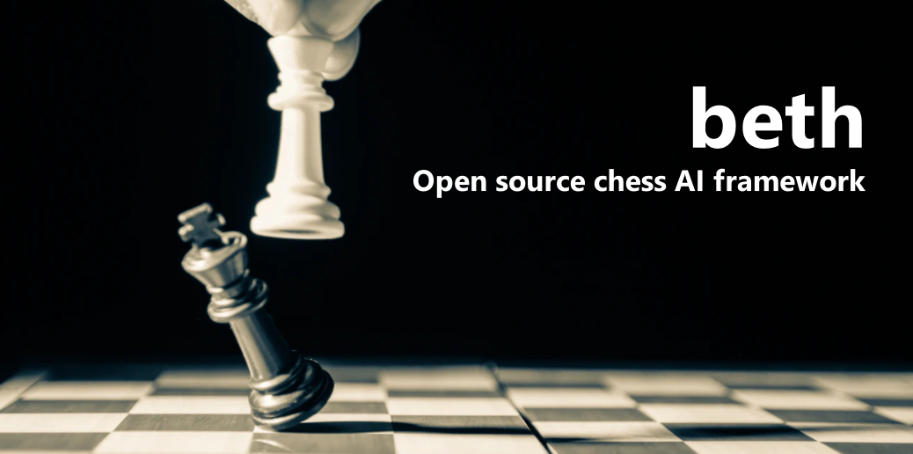

# ♟ Welcome to ``beth`` documentation



``beth`` is an open source chess AI framework. Like many, I re-discovered the game of chess by watching the Netflix show **the Queen's Gambit**. As a Data Scientist, it made we want to learn and explore the beauty of the game. 

At first my goal was to develop algorithms to help me learn chess. But over time, it lead to developing more and more features. What you will find is my personal experiments open sourced as a chess framework. I hope this framework to be ideal for chess programmers in Python to ease the development of new algorithms and engines.

!!! warning
    This repo is under active development, many features are still experimental.
    But please fill free to fork or PR

## Installation
You can install the library from PyPi with: 
```
pip install beth
```
Or clone and install from source

## Features
- Definition of a game environment using ``python-chess`` framework, with move parsing, board-to-numpy abstractions, PGN records, move replay. 
- Playing chess in Jupyter notebooks with widgets 
- Different player abstractions: ``HumanPlayer()``, ``RandomPlayer()``, ``AIPlayer()`` - to play Human vs AI, Human vs Human, or AI vs AI. 
- Connection to Stockfis engine to evaluate engine performances, available with ``StockfishAI()`` object abstraction
- Rules-based engine ``TreeSearchAI()`` with minimax tree search, alpha beta pruning, move ordering and board heuristics (~ELO 1000)
- First attempt of ML engine with a LSTM Neural Network to predict next moves

### Next roadmap features
If you are interested, please drop an issue or a PR, or contact me by [email](mailto:theo.alves.da.costa@gmail.com). Meanwhile the roadmap for ``beth`` is:

- Implementing a GUI (or connecting to an existing one) to ease experimentation
- ELO or TrueSkill measurement for any engine
- Improving minimax engine speed
- Developing ML engines:
  - Self supervised learning with Transformers
  - Reinforcement Learning


## Repo Structure
```
- beth/
- data/
    - raw/
    - processed/
- docs/                             # Documentation folder and website (.md, .ipynb) using Mkdocs
- notebooks/                        # Jupyter notebooks only (.ipynb)
- tests/                            # Unitary testing using pytest
- .gitignore
- LICENSE                           # MIT License
- poetry.lock                       # Poetry lock file
- pyproject.toml                    # Configuration file to export and package the library using Poetry
```